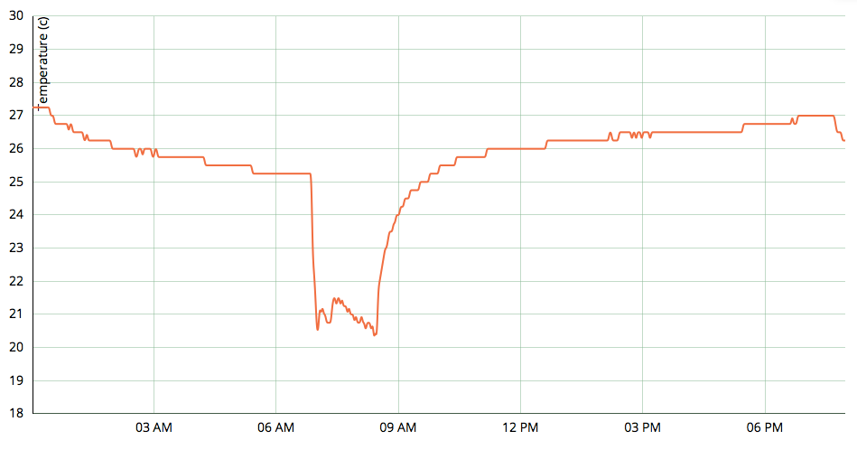

home-weather-station
====================

An arduino based weather station with visualisations powered by d3js.

It is able to generate graphs of the temperature in SVG format which looks like this:


Hardware setup
--------------
### Prerequisites
* Arduino UNO
* Maxim DSB18B20 thermal sensor
* A 4.7k resistor
* A micro breadboard
* Some wire jumpers
* A host PC with python

Software setup
--------------
### Prerequisites
* python
* pySerial (`pip install pyserial`)
* Arduino IDE (http://www.arduino.cc/en/Main/Software)

### How to run it
Start by cloning this repository:

    git clone git@github.com:Makohoek/home-weather-station.git

#### Configuring the arduino
Follow the small tutorial on http://www.hacktronics.com/Tutorials/arduino-1-wire-address-finder.html.
Note this serial number down, you will need it in the configuration step.
We will call it *my_serial_number*.

After that, you should edit the code from arduino/ds18b20_read_temperature/ds18b20_read_temperature.pde:
Go to line 32, you should see something like this:

```c
// Assign the addresses of your 1-Wire temp sensors.
// See the tutorial on how to obtain these addresses:
// http://www.hacktronics.com/Tutorials/arduino-1-wire-address-finder.html
DeviceAddress thermometer = { 0x28, 0x08, 0xF0, 0x5A, 0x06, 0x00, 0x00, 0x0B };
```

Replace the thermometer address with *my_serial_number* and flash this .pde file on your Arduino.

#### Core configuration
Then, edit the configuration file to match your setup:

    vim configuration.py

Here is my current configuration:

```javascript
config = {
    'arduino_serial_port': '/dev/cu.usbmodem621',
    'sample_interval': 10,
}
```
